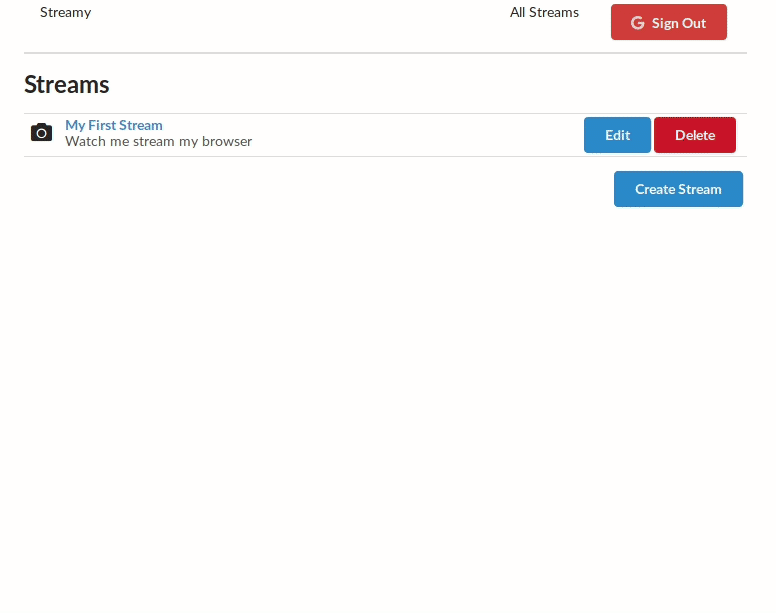

# Streamy

Aplicação React de gerenciamento de streams, que permite a exibição de um stream FLV ao vivo. Faz uso de autenticação Google para identificar usuários.



## Inicialização

Para iniciar o projeto é necessário que o Docker e o Docker Compose ja estejam instalados em sua máquina:

- [Docker](https://docs.docker.com/install/)
- [Docker compose](https://docs.docker.com/compose/install/)

Depois execute os comandos em sequencia:

```
docker-compose build

docker-compose up
```

Depois você pode acessar [localhost:3000](http://localhost:3000/) em seu navegador para interagir com a aplicação.

Para parar a aplicação, execute:

```
docker-compose down
```

## Criando e exibindo um stream

Você vai precisar de um software de streaming. Baixe e instale o [OBS Studio](https://obsproject.com/) em sua máquina.


Navegue para página inicial da aplicação em [localhost:3000](http://localhost:3000/) e clique no botão "Sign In with Google" para se logar através da sua conta Google. Tenha certeza de desativar qualquer bloqueador de propaganda que tenha, pois eles podem impedir que o popup de login apareça.

Uma vez logado você vai ver o botão "Create Stream", clique nele para ser levado para um formulário para preencher o nome e a descrição do stream, e finalize o cadastro clicando em "Submit".


Seu stream vai aparecer em uma lista na página inicial. Agora você precisa configurar o OBS para criar um stream que ficará associado ao que você acabou de cadastrar na aplicação.

Abra o OBS e vá para "Arquivo > Configurações > Transmissão". Coloque o serviço como "Personalizado" e use esta URL para o servidor: `rtmp://localhost/live`. A chave da transmissão é o que vai associar o que estiver transmitindo para o stream que criou na aplicação. Por padrão, é um ID sequencial que seu stream recebeu uma vez que cadastrou ele na aplicação. Se é seu primeiro stream, o id será `1`.


Crie uma nova Cena, e em seguida crie uma nova fonte de "Captura de Tela". Confirme todas as caixas de diálogo para usar as configurações padrão. Finalmente, clique em "Iniciar transmissão".


Com o OBS transmitindo sua área de trabalho usando a chave do seu stream, volte para a página [localhost:3000](http://localhost:3000/) e clique no link no nome do seu stream. Você será levado para uma página com um player de vídeo. Executar o player de vídeo vai mostrar a transmissão do OBS! Você pode configurar o OBS para transmitir qualquer coisa, não necessáriamente apenas a sua área de trabalho.

